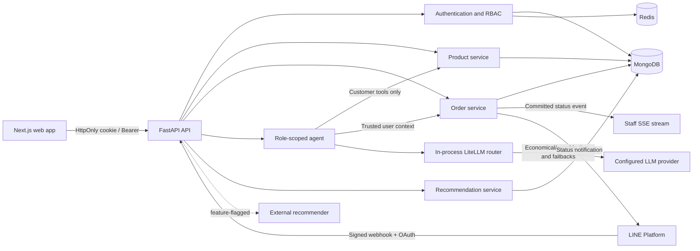
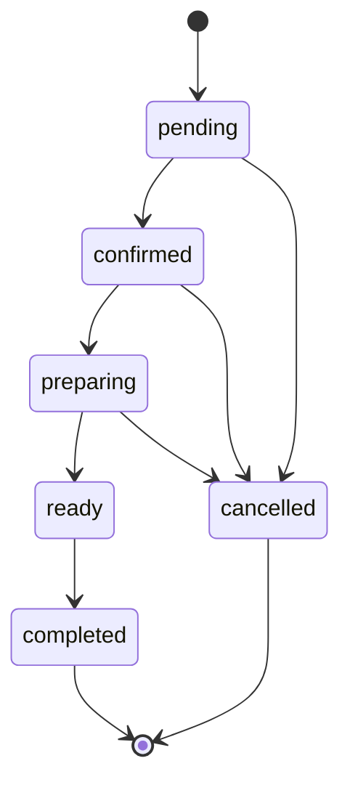

# Secure Food Ordering Platform

A portfolio-grade modular monolith for ordering food through a Next.js web application or a LINE chat assistant. The backend treats authentication, authorization, prices, order transitions, and idempotency as deterministic application concerns rather than LLM decisions.

> Security incident notice: a MongoDB URI was committed in the legacy backend. The current `main` branch was rewritten to a sanitized single root commit on 2026-08-22, but hosting caches, forks, and old clones may retain the former object. Treat the credential as compromised, rotate it outside this repository, and follow [the incident runbook](docs/security-incident-response.md).

## Problem statement

The original school prototype demonstrated LINE Login, a chatbot, MongoDB persistence, and basic ordering. It also trusted client-supplied identities and prices, initialized external clients during imports, and exposed privileged tools to a customer-facing LLM. This version establishes a secure foundation while preserving the FastAPI, MongoDB, LINE, LangChain, and Next.js technology choices.

## Implemented capabilities

- LINE OAuth with a single-use, expiring state, nonce validation, and HttpOnly access/refresh cookies
- Three application roles: `customer`, `staff`, and `admin`
- Customer-owned order creation, reading, and eligible cancellation
- Staff order queue and validated operational status transitions
- Authenticated SSE updates for the live staff queue with bounded per-client buffers
- LINE push notifications for confirmed, preparing, ready, completed, and cancelled orders
- Admin product management UI plus protected user-role management APIs
- Multi-item order schema with product/add-on snapshots and server-calculated totals
- Atomic status changes, status history, order idempotency, and LINE webhook deduplication
- Role-scoped AI tool factories; the customer toolset has no staff or admin operations
- Deterministic confirmation for AI-triggered order creation/cancellation, minimized tool DTOs, and per-user LLM rate limits
- Redis-backed, bounded, expiring LLM conversation context, confirmations, rate limits, and recommendation-result cache
- Feature flags for LINE, LLM, and the external recommender
- In-process LiteLLM complexity/cost routing, independent fallbacks, and safe opt-in Redis caching
- Structured redacted JSON logs and Prometheus request, order, and LLM metrics
- Slate-validated recommendation events, CPU-only trending/item-item artifacts, controlled rollout/rollback, and temporal Recall@K/NDCG@K evaluation
- Explicit CORS allowlist, request IDs, liveness, readiness, and non-root containers
- Dual-read compatibility and an idempotent legacy-order migration command
- GitHub Actions for lint, type-check, unit/integration tests, frontend build, and container smoke tests
- GHCR backend images with immutable commit tags, multi-architecture manifests, provenance, and SBOM metadata

## Repository layout

```text
.
├── apps/
│   ├── backend/              # FastAPI modular monolith
│   │   ├── app/api/          # HTTP routes and dependencies
│   │   ├── app/core/         # Settings, JWT, and middleware
│   │   ├── app/db/           # MongoDB lifecycle and indexes
│   │   ├── app/domain/       # Validated domain models and rules
│   │   ├── app/integrations/ # LINE and role-scoped AI agent
│   │   ├── app/services/     # Application services
│   │   ├── scripts/          # Explicit migration and CPU recommendation jobs
│   │   └── tests/
│   └── frontend/             # Next.js customer/staff web application
├── docker-compose.yaml
└── .env.example
```

## Architecture



The application remains one deployable backend. The modules separate responsibilities without introducing microservices or infrastructure that this project does not need.

## Security and role model

| Role | Permissions |
| --- | --- |
| `customer` | List products, create an own order, read own orders, cancel an eligible own order |
| `staff` | Read the operational queue and apply allowed status transitions |
| `admin` | Staff permissions plus product management and user role/activation management |

Every protected request resolves the current user from a signed JWT and reloads that user from MongoDB. Client payloads and LLM tool arguments cannot set `userId`, role, authoritative price, or initial status. Cross-customer reads return `404` to avoid disclosing resource existence. Missing authentication returns `401`; insufficient role permissions return `403`.

The customer AI allowlist is exactly:

- `list_products`
- `create_own_order`
- `view_own_orders`
- `cancel_eligible_own_order`

Staff tools are constructed separately. No user search, role update, product mutation, deletion, or plaintext password tool is exposed to the customer agent.

Prompt instructions are not an authorization boundary. Tool factories capture the authenticated user in server code, mutation tools require a short-lived pending action plus an exact follow-up confirmation, and tool results omit internal user IDs, status actors, and customer notes. Catalog and tool-output text is treated as untrusted data. See the [AI security model](docs/ai-security.md).

## Order lifecycle



Products and add-ons are loaded by ID when an order is created. Their names and prices are snapshotted, and the server calculates every line total, subtotal, and total. `completed` and `cancelled` are terminal states. Order creation requires an `Idempotency-Key` header; retries for the same customer return the original order.

## Local Docker setup

Requirements: Docker with Compose v2.

```bash
cp .env.example .env
# Replace placeholders and generate independent JWT and recommendation secrets.
docker compose up --build
```

- Web application: <http://localhost:3000>
- API documentation (non-production): <http://localhost:8000/docs>
- Liveness: <http://localhost:8000/api/v1/health/live>
- Readiness: <http://localhost:8000/api/v1/health/ready>

`LINE_ENABLED`, `LLM_ENABLED`, and `RECOMMENDER_ENABLED` default to `false`. Enabling a feature without all required variables fails configuration validation with a clear error.

## Environment variables

| Variable | Required | Purpose |
| --- | --- | --- |
| `APP_ENV` | No | `development`, `test`, or `production` |
| `MONGODB_URI` | Yes | MongoDB URI; no source fallback exists |
| `MONGODB_*_DATABASE` | No | Existing database names for backward compatibility |
| `REDIS_URL` | Yes in deployment | Redis endpoint for ephemeral shared state and sessions |
| `JWT_SECRET` | Yes | JWT signing secret, minimum 32 characters |
| `JWT_ISSUER`, `JWT_AUDIENCE` | No | JWT validation boundaries |
| `ACCESS_TOKEN_TTL_MINUTES`, `REFRESH_TOKEN_TTL_DAYS` | No | Access-token and rotating refresh-token lifetimes |
| `FRONTEND_URL`, `BACKEND_URL` | Yes in deployment | Canonical public URLs |
| `CORS_ORIGINS` | Yes | JSON array containing explicit origins |
| `COOKIE_SECURE` | Yes in production | Must be `true` in production |
| `LOG_LEVEL`, `LOG_JSON` | No | Structured application log configuration |
| `METRICS_ENABLED` | No | Exposes Prometheus metrics at `/metrics` |
| `SSE_HEARTBEAT_SECONDS`, `SSE_SUBSCRIBER_QUEUE_SIZE` | No | Staff-stream heartbeat and bounded subscriber buffer |
| `LINE_ENABLED` | No | Enables LINE OAuth and webhook handling |
| `LINE_CHANNEL_SECRET` | When LINE is enabled | Webhook signature secret |
| `LINE_CHANNEL_ACCESS_TOKEN` | When LINE is enabled | Messaging API credential |
| `LINE_LOGIN_CHANNEL_ID` | When LINE is enabled | OAuth client ID |
| `LINE_LOGIN_CHANNEL_SECRET` | When LINE is enabled | OAuth client secret |
| `LINE_REDIRECT_URI` | When LINE is enabled | Exact registered callback URL |
| `LLM_ENABLED` | No | Enables the customer ordering assistant |
| `LLM_API_KEY` | When LLM is enabled | Provider-neutral model credential |
| `LLM_API_BASE` | Provider dependent | OpenAI-compatible provider endpoint |
| `LLM_MODEL`, `LLM_PRIMARY_MODEL`, `LLM_COMPLEX_MODEL` | No | Logical route, economical model, and capable model |
| `LLM_COMPLEXITY_*` | No | Heuristic or optional LLM complexity classification and domain keywords |
| `LLM_FALLBACK_MODELS` | No | Independent provider/model fallbacks used after request failures |
| `LLM_ROUTING_STRATEGY`, `LLM_TIMEOUT_SECONDS`, `LLM_MAX_RETRIES` | No | Routing and reliability limits |
| `LLM_MAX_TOOL_ITERATIONS`, `LLM_MAX_OUTPUT_TOKENS` | No | Agent budget limits |
| `LLM_MEMORY_MESSAGES`, `LLM_MEMORY_TTL_MINUTES` | No | Per-user memory bounds and expiry |
| `LLM_CONFIRMATION_TTL_MINUTES`, `LLM_REQUESTS_PER_MINUTE` | No | Pending mutation expiry and per-process authenticated-user request limit |
| `LLM_CACHE_*` | No | Bounded local cache; customer-agent calls always use `no-store` |
| `LLM_*_COST_PER_MILLION` | No | Explicit inputs for estimated cost metrics |
| `RECOMMENDER_ENABLED`, `RECOMMENDER_URL`, `RECOMMENDER_TIMEOUT_SECONDS`, `RECOMMENDER_MODE` | No | Optional external provider and explicit `local`, `external_first`, or `external_fallback` policy |
| `RECOMMENDATION_USER_REF_SECRET`, `RECOMMENDATION_USER_REF_KEY_VERSION`, `RECOMMENDATION_USER_REF_PREVIOUS_SECRETS` | Yes / No | Dedicated pseudonym key, rotation label, and temporary version-to-old-key map for complete privacy purge; never reuse `JWT_SECRET` |
| `RECOMMENDATION_EVENT_RETENTION_DAYS`, `RECOMMENDATION_SLATE_RETENTION_DAYS` | No | MongoDB TTL retention for pseudonymous events and served slates |
| `RECOMMENDATION_DAILY_*_CAP` | No | Per-user/product/day engagement abuse bounds |
| `RECOMMENDATION_ITEM_ITEM_ROLLOUT_PERCENT` | No | Deterministic personalized-model rollout percentage; defaults to `0` |
| `RECOMMENDATION_MODEL_*`, `RECOMMENDATION_RESULT_CACHE_*`, `RECOMMENDATION_PROFILE_*` | No | Artifact polling, memory/size, result-cache, and profile bounds |
| `NEXT_PUBLIC_API_URL` | Yes for frontend build | Browser-visible API base URL |

See [.env.example](.env.example) for safe placeholders.

See [the LLM gateway design](docs/llm-gateway.md) and [the observability runbook](docs/observability.md) for routing, cache safety, logging, metrics, and operational guidance.

## Documentation

- [Documentation index](docs/README.md)
- [User and role guide](docs/user-guide.md)
- [Developer guide](docs/developer-guide.md)
- [API guide](docs/api-guide.md)
- [Operations runbook](docs/operations-runbook.md)
- [LLM gateway](docs/llm-gateway.md)
- [AI security model](docs/ai-security.md)
- [Observability runbook](docs/observability.md)
- [CPU recommendation-system plan](docs/recommendation-system-plan.md)
- [Credential incident runbook](docs/security-incident-response.md)

## Database compatibility and migration

The API reads both legacy and schema-v2 orders. New orders are always schema v2. Legacy prices are preserved only as historical snapshots and marked `legacyPriceUnverified`; they are never reused as authoritative catalog prices for a new order.

Run a read-only migration report first:

```bash
cd apps/backend
python -m scripts.migrate_orders_v2
```

After a database backup and verification in a non-production environment:

```bash
python -m scripts.migrate_orders_v2 --apply
```

The migration is idempotent and does not delete legacy fields. Rollout order: deploy dual-read/new-write code, back up the database, dry-run, apply in batches, compare document counts/totals, and retain the legacy reader until verification is complete.

Indexes are created at backend startup for user/time, status/time, active order lookup, order idempotency, webhook events, LINE identities, OAuth state TTL, recommendation slates/events/counters, completed-order training scans, and versioned model artifacts.

## Testing and quality checks

```bash
cd apps/backend
python3.12 -m venv .venv
.venv/bin/pip install -r requirements-dev.txt
.venv/bin/ruff check .
.venv/bin/ruff format --check .
.venv/bin/mypy app
.venv/bin/pytest -q

# Run the real MongoDB integration test against an isolated disposable instance.
TEST_MONGODB_URI=mongodb://localhost:27017 .venv/bin/pytest -q -m integration

cd ../frontend
pnpm install --frozen-lockfile
pnpm build

cd ../..
docker compose build

# Build/evaluate a bounded CPU-only model without writing to MongoDB.
cd apps/backend
.venv/bin/python -m scripts.build_recommendation_model
.venv/bin/python -m scripts.evaluate_recommendations --days 180 --test-days 14

# After reviewing the offline metrics, write and request activation.
.venv/bin/python -m scripts.build_recommendation_model --write --activate

# Roll back by atomically switching to a retained ready version.
.venv/bin/python -m scripts.build_recommendation_model \
  --write --rollback-version MODEL_VERSION
```

The backend tests cover missing configuration, JWT secret strength, 401/403 RBAC, cross-user order access, trusted price calculation, idempotent creation, invalid terminal transitions, OAuth state consumption, duplicate webhook delivery, customer-agent tool isolation, exact out-of-model mutation confirmation, indirect prompt injection, minimized agent DTOs, per-user LLM rate limiting, SSE fan-out, LINE status-notification boundaries, recommendation idempotency/privacy, offline metrics, log redaction, LiteLLM routing/cache policy, and a real MongoDB API flow. GitHub Actions supplies an isolated MongoDB service and also verifies missing/valid container startup behavior.

## Deployment

1. Rotate the exposed MongoDB credential before any deployment.
2. Store all production values in the deployment platform's secret manager; do not create a committed `.env`.
3. Use HTTPS URLs, set `APP_ENV=production` and `COOKIE_SECURE=true`, and configure an exact CORS allowlist.
4. Register the exact LINE callback and webhook URLs under the production domain.
5. Deploy MongoDB separately or use a managed provider with least-privilege network and database access.
6. Let GitHub Actions publish the backend to GHCR only after every quality and container gate passes.
7. Put the digest from the workflow summary in `deploy/compose.env`; production Compose pulls that exact backend image and connects it to Cloudflare Tunnel without exposing port `8000`.
8. Deploy `apps/frontend` through Vercel with `NEXT_PUBLIC_API_URL` pointing at the stable API hostname.
9. Gate traffic on `/api/v1/health/ready` and provision the first admin explicitly after that user completes LINE Login; never accept a role from a browser, OAuth claim, or LLM argument.

Production deployment files:

- [`compose.prod.yaml`](compose.prod.yaml) — backend plus Cloudflare Tunnel; no frontend, local MongoDB, or backend host port
- [`deploy/backend.env.example`](deploy/backend.env.example) — placeholder-only backend runtime configuration
- [`deploy/compose.env.example`](deploy/compose.env.example) — immutable image and local secret-file paths
- [Operations Runbook](docs/operations-runbook.md#image-publication) — GHCR, VM, Vercel, rollout, and rollback procedure

## Demo placeholders

- `[Screenshot: customer product list]`
- `[Screenshot: secure LINE Login flow]`
- `[Screenshot: multi-item order confirmation]`
- `[Screenshot: staff order queue]`
- `[Screenshot: admin product management]`
- `[Video: LINE assistant creates and tracks an own order]`

## Engineering trade-offs

- MongoDB database names remain configurable and default to the legacy `Users`, `Products`, and `Orders` databases to allow a safe incremental migration.
- Money is calculated with `Decimal` and stored as MongoDB `Decimal128`; legacy numeric values are normalized at the boundary.
- AI memory is bounded in Redis and expires. This limits retained chat PII while keeping the state consistent across backend replicas.
- HttpOnly cookies are used for the browser, while Bearer tokens remain supported for non-browser API clients.
- Physical deletion is avoided for products and users; operational state is preserved for auditability.
- Recommendation events store a keyed pseudonymous user reference rather than the MongoDB user ID. Offline time-decayed trending and item-item co-occurrence run on bounded CPU workloads and produce immutable MongoDB artifacts; no GPU, vector database, or separate service is required.

## Known limitations

- GitHub Actions passed backend, frontend, and container jobs for Phase 3 commit `e5bd195` on 2026-08-23; future changes must keep the same gates green.
- OAuth/webhook behavior requires real LINE sandbox credentials for end-to-end verification.
- Redis stores only token/session state and a SHA-256 digest of each refresh token, never raw refresh tokens. Access tokens and refresh tokens are rotated/revoked through Redis-backed session state.
- LiteLLM response caching is local to one process and intentionally disabled for customer-agent calls.
- SSE fan-out is process-local; a multi-replica deployment requires a shared event transport or single-replica queue affinity.
- Personalized item-item serving defaults to a `0%` rollout until an operator reviews temporal Recall/NDCG, coverage, artifact bounds, and activation-gate output.
- Recommendation artifacts remain immutable process-local runtime objects; short-lived personalized result cache entries are shared through Redis.
- The copied frontend history is not yet merged into the backend repository's commit graph; the original frontend repository is retained outside this monorepo working tree until a history-preserving merge is explicitly authorized.

## Roadmap

1. Keep GitHub Actions green, then add deployment screenshots and a demo recording.
2. Validate LINE OAuth, webhook, and order-status pushes with dedicated sandbox credentials.
3. Run controlled recommendation rollout at 5%, 25%, and 100% only after production-like latency and conversion monitoring.
